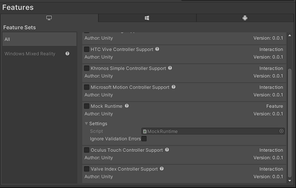
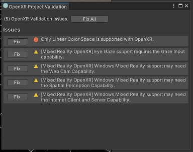

# OpenXR Features

OpenXR is an extensible API that can be extended with new features. To facilitate this within the Unity ecosystem, the Unity OpenXR provider offers a feature extension mechanism.

## Feature management window

**Note:** The configuration of this window might change in the future.



You can manage features from the **Project Settings &gt; XR Plug-in Management &gt; OpenXR &gt; Features** window.

To enable or disable a feature, select or clear the checkbox next to it. Unity doesn't execute disabled features at runtime, and does't deploy any of the feature's native libraries with the Player build. To configure additional build-time properties specific to each feature, click the arrow under a feature to expand the additional settings foldout.

All of the information in this window is populated via the `OpenXRFeatureAttribute` described below.

**Feature sets** group a number of different **features** together to allow you to configure them simultaneously, which might offer a better development experience. For more information, see the [Defining a feature set](#defining-a-feature-set) section on this page.

## Defining a feature

Unity OpenXR features are defined and executed in C#. C# can call to a custom native plugin if desired. The feature can live somewhere in the user's project or in a package, and it can include any Assets that a normal Unity project would use.

A feature must override the `OpenXRFeature` ScriptableObject class. There are several methods that you can override on the `OpenXRFeature` class in order to do things like intercepting native OpenXR calls, obtaining the `xrInstance` and `xrSession` handles, starting Unity subsystems, etc.

A feature can add public fields for user configuration at build time. Unity renders these fields via a `PropertyDrawer` in the feature UI, and you can override them. Your feature can access any of the set values at runtime.

A feature must also provide an `OpenXRFeature` attribute when running in the Editor.

```c#
 #if UNITY_EDITOR
    [UnityEditor.XR.OpenXR.Features.OpenXRFeature(UiName = "Example Intercept Create Session",
        BuildTargetGroups = new []{BuildTargetGroup.Standalone, BuildTargetGroup.WSA},
        Company = "Unity",
        Desc = "Example feature extension showing how to intercept a single OpenXR function.",
        DocumentationLink = "https://docs.unity3d.com/Packages/com.unity.xr.openxr@0.1/manual/index.html",
        OpenxrExtensionStrings = "XR_test", // this extension doesn't exist, a log message will be printed that it couldn't be enabled
        Version = "0.0.1",
        FeatureId = featureId)]
    #endif
    public class InterceptCreateSessionFeature : OpenXRFeature
    {
        /// <summary>
        /// The feature id string. This is used to give the feature a well known id for reference.
        /// </summary>
        public const string featureId = "com.unity.openxr.feature.example.intercept";
        
    }
```

Unity uses this information at build time, either to build the Player or to display it to the user in the UI.

## Defining a feature set

Unity OpenXR allows you to define a feature set you can use to enable or disable a group of features at the same time. This way, you don't need to access the **Feature** section in **Project Settings &gt; XR Plug-in Management &gt; OpenXR** window to enable or disable features.

Declare a feature set through the definition of one or more `OpenXRFeatureSetAttribute` declarations in your code. You can place the attribute anywhere because the feature set functionality only depends on the attribute existing and not on the actual class it's declared on.

```c#
      [OpenXRFeatureSet(
          FeatureIds = new string[] {   // The list of features that this feature set is defined for.
              EyeGazeInteraction.featureId,
              KHRSimpleControllerProfile.featureId,
              "com.mycompany.myprovider.mynewfeature",
              },
          UiName = "Feature_Set_Name",
          Description = "Feature set that allows for setting up the best environment for My Company's hardware.",
          // Unique ID for this feature set
          FeatureSetId = "com.mycompany.myprovider.mynewfeatureset",
          SupportedBuildTargets = new BuildTargetGroup[]{ BuildTargetGroup.Standalone, BuildTargetGroup.Android }
      )]
      class MyCompanysFeatureSet
      {}
```

You can configure feature sets in the **XR Plug-in Management** plug-in selection window. When you select the **OpenXR** plug-in from this window, the section under the plug-in displays the sets of features available. Not all feature sets are configurable. Some require you to install third-party definitions. The window displays information on where to get the required packages if needed.

### Enabling OpenXR spec extension strings

Unity will attempt to enable any extension strings listed in `OpenXRFeatureAttribute.OpenxrExtensionStrings` (separated via spaces) on startup. Your feature can check the enabled extensions in order to see if the requested extension was enabled (via `OpenXRRuntime.IsExtensionEnabled`).

```c#
protected virtual bool OnInstanceCreate(ulong xrInstance)
{
  if (!OpenXRRuntime.IsExtensionEnabled("XR_UNITY_mock_driver"))
  {
    Debug.LogWarning("XR_UNITY_mock_driver is not enabled, disabling Mock Driver.");
    
    // Return false here to indicate the system should disable your feature for this execution.  
    // Note that if a feature is marked required, returning false will cause the OpenXRLoader to abort and try another loader.
    return false;
  }

  // Initialize your feature, check version to make sure you are compatible with it
  if(OpenXRRuntime.GetExtensionVersion("XR_UNITY_mock_driver") < 100)
    return false;

  return true;
}
```

### OpenXRFeature call order

The `OpenXRFeature` class has a number of methods that your method can override. Implement overrides to get called at specific points in the OpenXR application lifecycle.

#### Bootstrapping

`HookGetInstanceProcAddr`

This is the first callback invoked, giving your feature the ability to hook native OpenXR functions.

#### Initialize

`OnInstanceCreate => OnSystemChange => OnSubsystemCreate => OnSessionCreate`

The initialize sequence allows features to initialize Unity subsystems in the Loader callbacks and execute them when specific OpenXR resources are created or queried.

#### Start

`OnSessionBegin => OnFormFactorChange => OnEnvironmentBlendModeChange => OnViewConfigurationTypeChange => OnAppSpaceChange => OnSubsystemStart`

The Start sequence allows features to start Unity subsystems in the Loader callbacks and execute them when the session is created.

#### Gameloop

Several: `OnSessionStateChange`

`OnSessionBegin`

Maybe: `OnSessionEnd`

Callbacks during the gameloop can react to session state changes.

#### Stop

`OnSubsystemStop => OnSessionEnd`

#### Shutdown

`OnSessionExiting => OnSubsystemDestroy => OnAppSpaceChange => OnSessionDestroy => OnInstanceDestroy`

### Build Time Processing

A feature can inject some logic into the Unity build process in order to do things like modify the manifest.

Typically, you can do this by implementing the following interfaces:

* `IPreprocessBuildWithReport`
* `IPostprocessBuildWithReport`
* `IPostGenerateGradleAndroidProject`

Features **should not** implement these classes, but should instead implement `OpenXRFeatureBuildHooks`, which only provide callbacks when the feature is enabled. For more information, see `OpenXRFeatureBuildHooks`.

### Build time validation

If your feature has project setup requirements or suggestions that require user acceptance, implement `GetValidationChecks`.  Features can add to a list of validation rules which Unity evaluates at build time. If any validation rule fails, Unity displays a dialogue asking you to fix the error before proceeding. Unity can also presents warning through the same mechanism. It's important to note which build target the rules apply to.

Example:

```c#
#if UNITY_EDITOR
protected override void GetValidationChecks(List<OpenXRFeature.ValidationRule> results, BuildTargetGroup targetGroup)
{
    if (targetGroup == BuildTargetGroup.WSA)
    {
        results.Add( new ValidationRule(this){
            message = "Eye Gaze support requires the Gaze Input capability.",
            error = false,
            checkPredicate = () => PlayerSettings.WSA.GetCapability(PlayerSettings.WSACapability.GazeInput),
            fixIt = () => PlayerSettings.WSA.SetCapability(PlayerSettings.WSACapability.GazeInput, true)
        } );
    }
}
#endif
```



### Custom Loader library

One and only one Unity OpenXR feature per BuildTarget canhave a custom loader library. This must be named `openxr_loader` with native platform naming conventions (for example, `libopenxr_loader.so` on Android).

Features with a custom loader library must set the `OpenXRFeatureAttribute`: `CustomRuntimeLoaderBuildTargets` to a list of BuildTargets in which a custom loader library is expected to be used. Features that do not use a custom loader library do not have to set `CustomRuntimeLoaderBuildTargets` (or can set it to null or an empty list).

The custom loader library must be placed in the same directory or a subdirectory of the C# script that extends the `OpenXRFeature` class. When the feature is enabled, Unity will include the custom loader library in the build for the active BuildTarget, instead of the default loader library for that target.

### Feature native libraries

Any native libraries included in the same directory or a subdirectory of your feature will only be included in the built Player if your feature is enabled.

## Feature use cases

### Intercepting OpenXR function calls

To intercept OpenXR function calls, override `OpenXRFeature.HookGetInstanceProcAddr`. Returning a different function pointer allows intercepting any OpenXR method. For an example, see the `Intercept Feature` sample.

### Calling OpenXR functions from a feature

To call an OpenXR function within a feature you first need to retreive a pointer to the function.  To do this use the `OpenXRFeature.xrGetInstanceProcAddr` function pointer to request a pointer to the function you want to call.  Using  `OpenXRFeature.xrGetInstanceProcAddr` to retrieve the function pointer ensures that any intercepted calls set up by features using `OpenXRFeature.HookGetInstanceProcAddr` will be included.

### Providing a Unity subsystem implementation

`OpenXRFeature` provides several XR Loader callbacks where you can manage the lifecycle of Unity subsystems. For an example meshing subsystem feature, see the `Meshing Subsystem Feature` sample.

Note that a `UnitySubsystemsManifest.json` file is required in order for Unity to discover any subsystems you define. At the moment, there are several restrictions around this file:

* It must be only 1 subfolder deep in the project or package.
* The native library it refers to must be only 1-2 subfolders deeper than the `UnitySubsystemsManfiest.json` file.
